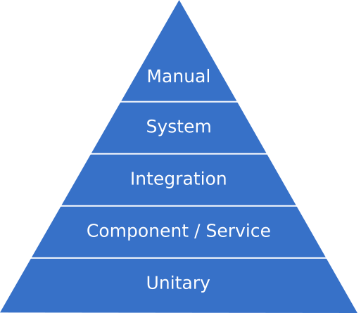

# SQA-Assignment

**Table of Content**:
1. [Introduction](https://github.com/Harmos274/SQA-Assignment#introduction)
2. [Task Estimation in Scrum](https://github.com/Harmos274/SQA-Assignment#task-estimation-in-scrum)
3. [Coding Standards](https://github.com/Harmos274/SQA-Assignment#coding-standards)
4. [Code Reviews](https://github.com/Harmos274/SQA-Assignment#code-reviews)

## Introduction

## Task Estimation in Scrum

## Coding Standards

- Follow as much as possible the SOLID Principles
- Test your code with Pytest
- You tests need to be fast, simple and readable
- Follow the requested project structure
- Follow the PEP8 directives as much as possible, **except the 80 columns restriction**

### General Knowledge

#### Solid Principles

In this company we believe in SOLID principles, because our softwares needs to be reliable on the long term, we need to make them easily maintainable.

SOLID stands for:
- **S**ingle Responsability
- **O**pen/Closed Principle
- **L**iskov Substitution
- **I**nterface Segregation Principle
- **D**ependency Injection

This is a set of rules created to build better scalable softwares.
Concisely, you need to ensure that every atomic element of your code serves only one purpose. The best thing to do is asking to yourself what is the purpose of what your coding, if it's "this ***and*** that" then you need to split your component in two. You also need to change the least possible the code already done, and work by extending it instead of rewriting it.

Keep in mind that all the principles are purely **good practices** and sometimes you'll need to transgress them because the situation needs it.

Read [that article](https://stackify.com/solid-design-principles/) to learn more about SOLID principles.

#### Testing practices

Unit tests allow the developer to be sure that an extract of code works. It consists of small tests making sure small parts of code operate well.

>Unit tests help you find and fix bugs earlier.

>Your suite of unit tests becomes a safety net for developers.

>Unit tests can contribute to higher code quality.

>Unit tests might contribute to better application architecture.

>Unit tests can act as documentation.

>Detect code smells in your codebase.

Unit Tests Role In A QA Strategy, and it is one of the best ways to get constant feedback on your code. It is additional with other types of code, being part of the practical test pyramid, but is the testing section performed by developers.



Tests should be fast, simple and readable, but should not repeat logical implementation of code.
If you want a complete discussion on unit testing, and a list of useful good practices, please read [this](https://www.testim.io/blog/unit-testing-best-practices/).

### Python 3

#### Project Structure

To prevent a certain lack of consistency between projects every Python 3 projects needs to follow a specific file structure.

For example if you're developing on a project named `sample` you'll see that kind of file structure:

```
Makefile
README.md
LICENSE
setup.py
requirements.txt
sample/__init__.py
sample/core.py
sample/helpers.py
docs/conf.py
docs/index.rst
tests/test_basic.py
tests/test_advanced.py
```

As you can see the `sample/` folder is where the actual business code of the project is. There's also a `test/` folder where you can put your tests.
The `requirements.txt` file is a `pip` requirement file where all the packages needed to run the program are specified using the [pip format](https://pip.pypa.io/en/stable/reference/requirements-file-format/#example).

To know more on this structure you can read [this article](https://docs.python-guide.org/writing/structure/), it also includes some architecture advice.

#### PEP8 

On Python 3 we choose to follow the [PEP8](https://realpython.com/python-pep8/) set of rules, which are the most classics rules in Python that almost everybody follows. Here are some basic keypoints:

- Function names are in `snake_case` and are named with verb
- Variable names are in `snake_case` and are named with word or a single letter
- Classes are in `PascalCase` and their methods in `snake_case`
- Constants are in `SCREAMING_SNAKE_CASE` and are named with full words
- Module names are in `snake_case`
- Package names are named in `lowercase` with no space or separation between words
- Use 4 consecutive spaces for each level of indentation

Note that **we don't use the 80 characters limit per line**, you need to be concise but no needs to break your line at weird places to stay in your character limit.

If you want to practice a bit how to write good python code you can follow [this courses](https://openclassrooms.com/en/courses/6900866-write-maintainable-python-code) on OpenClassrooms which will introduce you to PEP8 and also teach you some useful design patterns.

#### Unit Testing with Pytest

In order to apply a quality assurance policy, the company has chosen Pytest to run unit tests.
Pytest is an external testing module for python. It is more intuitive and easier to use than the built in Python 3 testing module.
You can organize your tests in classes, this allow you to respect the separation of concern practice.
This module gives the developers a simple way to test their code when unexpected things happen.

>Testing that your program responds as expected in negative situations is very important.

Pytest is pretty easy to use, because it provides developers an API to test functions:

```python
def inc(x):
    return x + 1


def test_answer():
    assert inc(3) == 5
```

Pytest would answer:

```
______________________________test_answer_______________________________

    def test_answer():
>       assert inc(3) == 5
E       assert 4 == 5
E        +  where 4 = inc(3)

test_sample.py:6: AssertionError
========================short test summary info=========================
FAILED test_sample.py::test_answer - assert 4 == 5
===========================1 failed in 0.12s============================
```


Pytest allows developers to use mocks, in order to imitate modules that we do not want to test, because we consider them external to our code. For example, you can mock HTTP responses to test your program in a lot of different situations.

You can get a full guide of Pytest by reading this [article](https://medium.com/worldsensing-techblog/tips-and-tricks-for-unit-tests-b35af5ba79b1).

## Code Reviews

