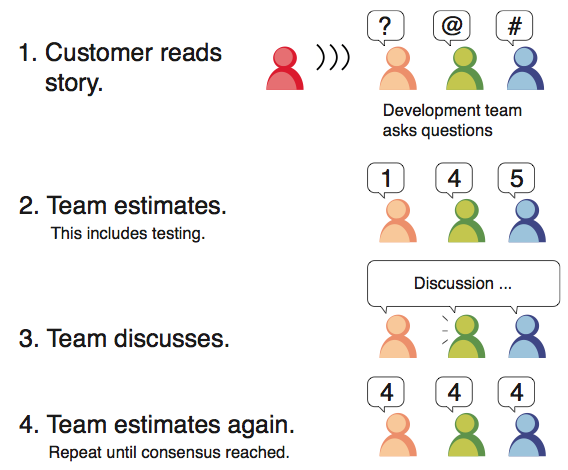

# SQA-Assignment

**Table of Content**:
1. [Introduction](https://github.com/Harmos274/SQA-Assignment#introduction)
2. [Task Estimation in Scrum](https://github.com/Harmos274/SQA-Assignment#task-estimation-in-scrum)
3. [Coding Standards](https://github.com/Harmos274/SQA-Assignment#coding-standards)
4. [Code Reviews](https://github.com/Harmos274/SQA-Assignment#code-reviews)

## Introduction

## Task Estimation in Scrum

### Introduction

### How to Estimate Tasks

### Most Common Errors

Here you can find two articles treating the easy mistakes you can make while estimating tasks in SCRUM: [12 Common Errors Made When Using Story Points]() and [Do & Don’t - Sprint Backlog Estimation](). Those posts are really interesting and explain the major issues in using story points, during the estimation but also during the rest of the sprint.

However, some mistakes seem **occur frequently**:

#### Don’t Compare Story Points With Hours

The effort estimation is **relative** between each developer, story points allow developers who work at different speeds to **estimate effort together**. By translating it into hours, you lose the main reason to use story points.

#### Averaging Story Points

During the estimation process, if half of the team says 2, and the second half says 5, it is a **mistake** to average story point at 3. Task estimation trend to **lower the risk** of unknown size or complexity of product backlog items. If a huge difference in estimation happens, it frequently attests of **hidden complexity** or **misunderstanding** of the task. You also will lose an opportunity for an interesting discussion.

To avoid the averaging of story points, it is recommended to **discuss and estimate again** to use the process explained by the image above.

#### Conforming to the Expert in the Room

While estimating the tasks, it is highly likely that every member of the team would **conform with the expert** of the group. To avoid it, it is recommended to let the expert **explain his view of the task**, and then proceed to the estimation **without the expert**.

As story points do not take part in the **SCRUM guide**, a lot of teams have different opinions about them. Knowing things not to do will help you to exploit **the power of story points**.

## Coding Standards

## Code Reviews

